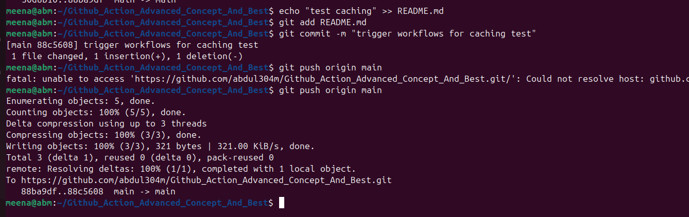

# Github_Action_Advanced_Concept_And_Besttest caching
test caching

# Github_Action_Advanced_Concept_And_Best 

# Lesson 1: Best Practices for GitHub Actions

## Objectives:
- Understand how to write maintainable GitHub Actions workflows.
- Learn about code organization and creating modular workflows.

## Step 1. — Add GitHub workflow files
- Create the folder structure and three workflows: " mkdir -p .github/workflows" 

## 1a Reusable workflow (modular piece)
- This is where we put common CI steps once, then “call” it from other workflows.

- Create .github/workflows/reusable-node-ci.yml with this content:

## 1b Build & Test workflow (calls the reusable one)
- Create .github/workflows/build.yml:

## 1c Deploy workflow (separate file, cleanly named)
- We’ll make it a placeholder you can wire to real deploys later. Create .github/workflows/deploy.yml:

This setup shows:
- clear names 

- comments in YAML 

- modularization with a reusable workflow 

- organized files (build.yml, deploy.yml) 

## Step 4 — Commit and push to GitHub

Either create a repo on GitHub first and copy its URL, or use GitHub CLI. From your project folder:

## Lesson 2: Performance Optimization 
Objectives:

- Optimize the execution time of workflows.

- Implement caching to speed up builds

Optimizing Workflow Execution Time:

## Step 1: Update your workflow

Make sure your .github/workflows/build.yml has caching enabled like this

.

## Step 2: Push changes
Commit & push:

## Step 3: Watch the first run
- Go to your repo on GitHub → Actions tab → open the workflow run.

- Expand the Cache npm modules step.

- On the first run, you will see something like:
"Cache not found for input keys: Linux-node-abc123"  This is expected because there is no catche.
.

## Step 4: Watch the second run
- Push something small (like editing README.md):
.

- Go back to Actions → open the new workflow run.

- Expand Cache npm modules again.

- This time you should see something like: "Cache restored from key: Linux-node-abc123"

## Step 1: Add a Secret to Your Repo
- Go to your GitHub repository.

- Click Settings → on the left, scroll to Secrets and variables → Actions.

- Click New repository secret.

- Name it (e.g., ACCESS_TOKEN).

- Paste any value (for learning you can use something simple like mysecret123).
![]
- Save it ✅.

Now GitHub has stored your secret in an encrypted way.

## Step 2: Reference the Secret in Workflow
Inside your .github/workflows/build.yml (or a new workflow), add an environment variable using secrets.ACCESS_TOKEN.

Example workflow:

## Step 3: Trigger & Check Logs
- Commit and push this workflow.

- Go to Actions tab → run details → open Use Secret Safely step.

- You should see output like:" Secret is available!
Secret length is: 12"

 0c99b34 (summitting on project github Action Advanced concept)
